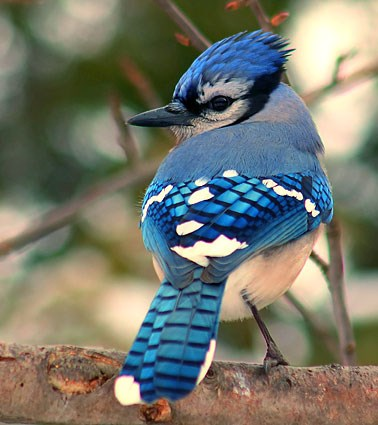

```{r setup, include=FALSE}
knitr::opts_chunk$set(echo = TRUE,fig.align='center')
```


```{r echo=FALSE, message=FALSE, include=FALSE}
library(ggplot2)
library(psych)
library(factoextra)
library(Stat2Data)
library(gridExtra)
library(grid)
data("BlueJays")
df <- BlueJays[,-c(1,2)]
```

## BlueJays

Данные -- размеры синих соек.



Признаки:

```{r}
names(df)
```

 * BillDepth -- Глубина ноздри (мм)
 * BillWidth -- Ширина клюва (мм) 
 * BillLength -- Длина  клюва (мм)
 * Head -- Расстояние от кончика клюва до затылка (мм)
 * Mass  -- Вес тела (г)
 * Skull -- Обхват черепа (мм)
 * Sex -- Пол птички (0 == female, 1 == male)
 
Краткий обзор данных: 

```{r, warning=FALSE}
describe(df, fast=T)
```

```{r echo=FALSE, fig.align='center'}
pairs(df[,-7],col=df$Sex+1)
```

Красным выделены мальчики, черным -- девочки.

```{r}
cr <-  cor(df[,-7])
print(cr , digits = 2)
```

Все корреляции положительны -- сразу можем сказать, что первая компонента будет соответствовать размеру птички.

Можно заметить, что в среднем птички мужского пола больше женского (сравнив среднее в группах и длину доверительного интервала se)

```{r}
describeBy(df,df$Sex,fast = T,mat = T, digits = 2)
```


## PCA

Немного теории. Пусть $\mathbf{X}\in \mathrm{R}^{n\times p}$ -- матрица данных.

$$ \mathbf{X}^\mathrm{T} = \sum_{i=1}^d\sqrt{\lambda_i}U_iV_i^\mathrm{T} = \sum_{i=1}^d F_iV_i^\mathrm{T} = \sum_{i=1}^d U_i Z_i^\mathrm{T}, $$
где

1) $U_i$ -- матрица поворота, собственные вектора корреляционной матрицы. Интерпретация -- коэффициенты линейной комбинации изначальных орт для получения главных компонент;

2) $V_i$ -- факторные вектора, нормированные главные компоненты;

3) $F_i$ -- факторные веса (нагрузки), $F_i = \sqrt{\lambda_i}U_i$,

$$f_{ij} = <X_i^\mathrm{(c)},V_j > = \widehat{\text{cov}}(X_i^\mathrm{(c)},V_j) ;$$

4) $Z_i$ -- главные компоненты, $z_{ij} = <\mathbf{X}^\mathrm{T}_i,U_j>$ -- координата i-го индивида в базисе из $\{U_j \}$.

Разберем следующие пакеты для АГК

```{r echo=T, message=F}
library("ade4")
```

### ade4 package

Основная функция - ?dudi.pca()                       
```{r eval=F}
dudi.pca(df, row.w = rep(1, nrow(df))/nrow(df), 
    col.w = rep(1, ncol(df)), center = TRUE, scale = TRUE, 
    scannf = TRUE, nf = 2)
```
    
Для начала исключим из анализа признак "Sex", то есть попробуем найти отличия не между индивидами, а между группами.
    
```{r}
pca1 <- dudi.pca(df[,-7],scannf = F, nf=6)
pca1
```

В старых обозначениях:

1)pca\$tab == $\mathbf{X}^\mathrm{(s)}$, стандартизованная матрица;

2)pca\$li == $\mathbf{Z}$, главные компоненты;

3)pca\$l1 == $\mathbf{V}$, факторные вектора;

4)pca\$co == $\mathbf{F}$, факторные нагрузки;

5)pca\$c1 == $\mathbf{U}$, матрица поворота.

Рассмотрим матрицу собственных векторов.

```{r}
pca1$c1
```

Как и ожидалось, все признаки вошли в первую компоненту с одним знаком -- первая компонента отвечает за общий размер птички. Во второй компоненте можно заметить, что признаки разделились на размеры тела и размеры клюва -- вторая компонента определяет "носатость" птички.

### factoextra

Пакет для визуализации полученных данных.

Основные функции

 * get_eigenvalue(res.pca)
 * fviz_eig(res.pca)
 * get_pca_ind(res.pca), get_pca_var(res.pca)
 * fviz_pca_ind(res.pca), fviz_pca_var(res.pca)
 * fviz_pca_biplot(res.pca)
 

```{r}
eig <- get_eigenvalue(pca1)
eig
```

Тут представлены $\lambda_i$, индивидуальный вклад дисперсии и накопленный вклад дисперсии.

```{r}
fviz_eig(pca1,addlabels = T)
```

Scree plot, визуализирующий вклад компонент.

Первые две компоненты имеют 70% объясненной дисперсии.

```{r}
get_pca_var(pca1)
```

С помощью функции get_pca_var можем получить информацию о признаках.

1) \$coord -- координаты признаков, $\mathbf{F}$, факторные нагрузки;

2) \$cor -- корреляции между признаками и факорными векторами, в случае стандартизации совпадает с \$coord;

3) \$cos2 -- $\cos^2(X_i,V_j)$, в случае стандартизации есть $\{f_{ij}^2\}$;

4) \$contrib -- вклад $\cos^2$ i-го признака в j-ю главную компоненту в процентах

$$\text{contrib}_{ij}=100\dfrac{\cos^2(X_i,V_j)}{\sum_{k=1}^p \cos^2(X_k,V_j)} .$$


```{r}
get_pca_ind(pca1)
```

Аналогично для индивидов.

Визуализируем полученные результаты.

```{r}
fviz_pca_biplot(pca1, repel = TRUE, label = "var") #8; 74 and 82 
```

Синие стрелки -- $U_i$, оси есть $Z_i$ (вычисляется по нормировке).

Как и ожидалось -- знак всех признаков совпал по первой компоненте, что означает, что в первую очередь птички различаются по размеру. Также можно увидеть несколько выделяющихся наблюдений. Попробуем убрать их.

```{r}
df2 <- df[-c(8,74,82),]
pca2 <- dudi.pca(df2[,-7],scannf = F, nf=6)
fviz_eig(pca2,addlabels = T)
fviz_pca_biplot(pca2, repel = TRUE, label = "var")
```

Можно заметить, что изменилось направление стрелки с признаком "BillWidth".

```{r}
fviz_pca_var(pca2, geom = c("point","arrow","text"),
             pointshape = 21, fill = "#E7B800", repel=T)

fviz_pca_var(pca2,  geom = c("point","arrow","text"),
             pointshape = 21, fill = "#E7B800", repel=T, axes = c(1,3))

fviz_pca_var(pca2,  geom = c("point","arrow","text"),
             pointshape = 21, fill = "#E7B800", repel=T, axes = c(2,3))
```

Оси -- главные компоненты ($V_i$), стрелки -- $F$, размер точки соответствует $\cos^2$ между признаком и рассматриваемым пространством главных компонент.

Как мы интерпретировали ранее, первая компонента символизирует размер птички. Как оказалось, ширина клюва (BillWidth) практически ортогональна рассматриваемому пространству и практически не вносит вклад в первые две компоненты. Второй признак показывает различие между носом птички и её телом, то есть показывает "носатость" птички.

Как оказалось, третья компонента состоит в основном из ширины клюва BillWidth.

Напомним, что так как сейчас рассматриваются неоднородные данные (птички обоих полов), неоднородные потому что различия в характеристиках значимые, то данные компоненты показывают разницу не между птичками, а между группами.

```{r}
fviz_pca_ind(pca2,
             geom.ind = "point", 
             col.ind = BlueJays$KnownSex[-c(8,74,82)], # color by groups
             palette = c("#FC4E07","#00AFBB"),
             addEllipses = TRUE, # Concentration ellipses
             #ellipse.type = "confidence",
             legend.title = "Sex",
             mean.point = FALSE,
             ellipse.level=0.95)
```

Можно убедиться в этом, раскрасив точки (в соответствии с признаком Sex).

В пакете ade4 есть удобные функции для построения графиков с разбиением

```{r}
s.class(pca2$li,
fac = BlueJays$KnownSex[-c(8,74,82)],  # color by groups
col = c("#FC4E07","#00AFBB"),cellipse = 2.5
)
```

Первая компонента разделяет две группы, среднее в каждой группе лежит на PC1.
<!-- ```{r} -->
<!-- fviz_contrib(pca1, choice = "var", axes = 1, top = 10) -->
<!-- fviz_contrib(pca1, choice = "var", axes = 2, top = 10) -->
<!-- fviz_contrib(pca1, choice = "var", axes = 1:2, top = 10) -->
<!-- ``` -->

Попробуем рассмотреть каждую группу отдельно.

```{r}
df3 <- subset(df2,Sex == 1,select = -Sex)
pca3 <- dudi.pca(df3[,-7],scannf = F,nf = 6)
df4 <- subset(df2,Sex == 0,select = -Sex)
pca4 <- dudi.pca(df4[,-7],scannf = F,nf = 6)
```


```{r}
p1 <- fviz_eig(pca3,addlabels = T,title = "Male",barfill="#00AFBB")
p2 <- fviz_eig(pca4,addlabels = T,title = "Female",barfill="#FC4E07")
grid.arrange(p1,p2, ncol=2,top="Scree plot")
```

Вклады компонент в группах похожи, но отличаются от случая, когда мы рассматривали всех птичек вместе, ранее первая компонента объясняла больше дисперсии (54%).

```{r}
fviz_pca_biplot(pca3,label = "var",title = "Male",col.var = "#00AFBB") #41
fviz_pca_biplot(pca4, label = "var",title = "Female",col.var = "#FC4E07",repel = T)
```

У мальчиков можно заметить индивида, выделяющегося по первой компоненте, попробуем убрать его.

```{r}
df3 <- subset(df[-c(8,74,82,41),],Sex == 1,select = -Sex)
pca3 <- dudi.pca(df3[,-7],scannf = F,nf = 6)
fviz_eig(pca3,addlabels = T,title = "Male",barfill="#00AFBB")
fviz_pca_biplot(pca3,label = "var",title = "Male",col.var = "#00AFBB")
```

Теперь первая компонента объясняет меньше дисперсии, чем раньше.

```{r}
fviz_pca_var(pca3, geom = c("point","arrow","text"),
             pointshape = 21, fill = "#00AFBB", repel=T, subtitle = "Male")
fviz_pca_var(pca3, geom = c("point","arrow","text"),
             pointshape = 21, fill = "#00AFBB", repel=T, axes = c(1,3), subtitle = "Male")
fviz_pca_var(pca3, geom = c("point","arrow","text"),
             pointshape = 21, fill = "#00AFBB", repel=T, axes = c(2,3), subtitle = "Male")


fviz_pca_var(pca4,  geom = c("point","arrow","text"),
             pointshape = 21, fill = "#FC4E07", repel=T, subtitle = "Female")
fviz_pca_var(pca4,  geom = c("point","arrow","text"),
             pointshape = 21, fill = "#FC4E07", repel=T, axes = c(1,3), subtitle = "Female")
fviz_pca_var(pca4,  geom = c("point","arrow","text"),
             pointshape = 21, fill = "#FC4E07", repel=T, axes = c(2,3), subtitle = "Female")
```

Для мальчиков оказалось, что глубина и ширина клюва практически не вошли в первые две компоненты, то есть носатость птичек описывается в основном длиной клюва. Взглянем на вклады признаков в новые компоненты.

```{r}
get_pca_var(pca3)$contrib[,1:3]
```

Ширина клюва BillWidth не имеет особый вклад в первые три компоненты (объясняющие 77% дисперсии) и тем самым не является важным признаком для различия индивидов-мальчиков. Таким образом первая компонента характеризует размеры птичек, вторая -- соотношение клюва (его длины) и тела птички (размера черепа), третья -- клюв птичек.

У девочек можно заметить, что ситуация похожа на случай, когда мы рассматривали всех индивидов сразу.

```{r}
get_pca_var(pca4)$contrib[,1:3]
```

Первая компонента показывает размер птичек, вторая -- "носатость" (отношение длины клюва и глубины ноздрей к размеру черепа), третья определяет ширину клюва.
