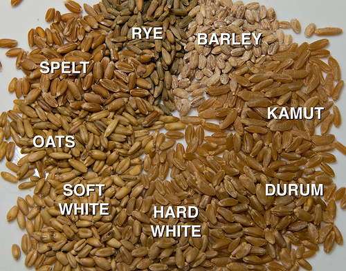

```{r setup, include=FALSE}
knitr::opts_chunk$set(echo = TRUE,message = FALSE, fig.align = 'center')
library("Stat2Data")
library(ggplot2)
library(psych)
library(MASS)
library(mvnormtest)
library(klaR)
library(heplots)
library(candisc)
library(factoextra)
library(dplyr)
library("ade4")
data("BlueJays")
df <- read.table("seeds_dataset.txt")
df <- df %>% mutate(V8 = as.factor(V8))
```

## Данные

Измерения геометрических свойств ядер трех разных сортов пшеницы. [Ссылка на источник](https://archive.ics.uci.edu/ml/datasets/seeds#).

Пример исследуемых объектов




Для построения признаков были использованы следующие параметры ядер пшеницы

  1. area A,
  2. perimeter P,
  3. compactness C = 4*pi*A/P^2,
  4. length of kernel,
  5. width of kernel,
  6. asymmetry coefficient
  7. length of kernel groove. 
 
Описательная статистика по группам и matrixplot.
 
```{r echo=FALSE,fig.align="center"}
describeBy(df[,-8],df$V8,fast=T)
pairs.panels(df[,-8],
             lm=F,smooth = F,ellipses = F,
             scale = T,cex.cor = 1, gap=0.2,
             bg=c("red","green","black")[df$V8],pch=21,
             alpha = 0.5)
```

Распределение признаков не самое лучшее, также данные сильно скоррелированны (что неудивительно, так как все признаки описывают в каком-то смысле размеры ядрышка, кроме признака V6). Отметим наличие сбалансированного дизайна.

## LDA

Сначала немного про MANOVA.

Общая постановка задачи. Пусть есть k групп и p признаков, мы пытаемся проверить,
что группы друг от друга не отличаются. Формально есть k (многомерных) случайных
векторов $\eta_1,\ldots,\eta_k\in\mathrm R ^p$. Предполагается, что $\mathcal P (\eta_i) = \mathcal N (a_i,\Sigma)$. Тогда

$$ \mathrm H_0:\, \mu_1=\ldots = \mu_k ;$$

эквивалентно этому можно рассмотреть

$$ \mathrm H_0 : \mathrm E(\eta|\xi=A_1) = \ldots= \mathrm E(\eta|\xi=A_k) .$$

Обозначим

$$ \mathbf E :=\widehat{ \mathrm E[(\eta - \mathrm E(\eta|\xi))(\eta - \mathrm E(\eta|\xi))^\mathrm T]}
= \sum_{i=1}^k \sum_{j=1}^{n_i}  (y_{ij} - \mathbf{ \bar y_i})(y_{ij} - \mathbf{ \bar y_i})^\mathrm T;$$

$$\mathbf H :=\widehat{ \mathrm E[(\mathrm E(\eta|\xi)-\mathrm E \eta)(\mathrm E(\eta|\xi)-\mathrm E \eta)^\mathrm T]}
= \sum_{i=1}^k n_i (\mathbf{\bar y_i - \bar y})(\mathbf{\bar y_i - \bar y})^\mathrm T
$$

и $s=\min(k-1,p)$.

Тогда статистика критерия MANOVA

  1. Lambda Wilks's
  
$$ t = \mathbf{ \frac{|E|}{|H+E|} =\dfrac{1}{|1+E^{-1}H|}=\prod_{i=1}^s\frac{1}{1+\lambda_i}\sim\Lambda_p(k-1,n-k)}.$$

  2. Roy's largest root 
  
$$Q=\frac{\lambda_1}{1+\lambda_1} = r_1^2.$$

  3. Pillai's

$$V^{(s)}=\text{tr}(\mathbf{H(E+H)^{-1}}) = \sum_{i=1}^s r_i^2.$$


  4. Hotelling
  
$$U^{(s)}=\text{tr}(\mathbf{E^{-1}H}) = \sum_{i=1}^s \lambda_i.$$

---

Напомним, что имеется $p$ признаков и $k$ групп: $\eta\in\mathrm R^p$, причем $\mathcal P (\eta|\xi=A_i) = \mathcal N (\mu_i,\Sigma)$.

Попытаемся на основе имеющихся $p$ признаках построить новые, по которым
3группы «наиболее бы отличались», причем было бы удобно, чтобы эти новые признаки были ортогональны. Эта неформальная задача на самом деле очень просто формализуется, как мы увидем несколько далее.

Взглянем на F-статистику дисперсионного анализа

$$F = F(A) = C\frac{A^\mathrm T \mathbf H A}{A^\mathrm T \mathbf E A} \sim F_{k-1,n-k},$$

где $C$ не зависит от $A$.

Исходно ставилась задача — найти такие признаки, по которым группы «наиболее бы отличались», причем желательно, чтобы признаки были ортогональны. В терминах максимизации статистики $F$ — это означает, что решается обобщенная задача на собственные числа и собственные вектора.

$$\frac{A^\mathrm T \mathbf H A}{A^\mathrm T \mathbf E A}\rightarrow\max_A .$$

Обозначим собственные числа матрицы $\mathbf{E^{-1}H}$ в порядке невозрастания: $\lambda_1\geq\ldots\geq\lambda_s$ , где $s=\min (p,k-1)$, и собственные вектора той же матрицы — $A_i$ для $i\in 1:s$.
Причем $A_i^\mathrm T\mathbf E A_j = 0$ для $j \neq i$. Вектора $A_i$ — канонические коэффициенты (дискриминантные функции). Новые признаки $Z_i=\mathbf Y A_i$ — канонические переменные.


#### Проверка на нормальность

```{r}
sapply(unique(df$V8),function(x) {
  mshapiro.test(t(df %>% filter(V8 == x) %>% dplyr::select(-V8)))
})
```

Гипотеза отвергается.

#### Гомоскедаксичность (Box's M-test)

```{r}
res <- boxM(df[,-8],df[,8])
summary(res)
```

Гипотеза отвергается.

#### Проверка значимости различия групп

```{r}
df.mod <- lm( cbind(V1,V2,V3,V4,V5,V6,V7) ~ V8,data = df)
Anova(df.mod,test = "Wilks")
```

Различие значимо (можно убедиться в этом визуально и с помощью описательной статистики по группам, приведенной выше).

#### LDA (package "candisc")

Результаты LDA

```{r,fig.align="center"}
df.lda <- candisc(df.mod,data = df)
df.lda
```


```{r}
plot(df.lda,ellipse = T)
```

---


Пусть $\mathbf Y$ — матрица данных. Матрица межгрупповых отклонений $\mathbf H = \sum_{i=1}^k n_i (\mathbf{\bar y_i - \bar y})(\mathbf{\bar y_i - \bar y})^\mathrm T$ , матрица $\mathbf E = \sum_{i=1}^k \sum_{j=1}^{n_i}  (y_{ij} - \mathbf{ \bar y_i})(y_{ij} - \mathbf{ \bar y_i})^\mathrm T$.

$A_1,\ldots,A_s$ — собственные вектора $\mathbf{E^{-1}H}$, называемые дискриминантными функциями, $\lambda_i$ — упорядоченные по убыванию собственные числа. Канонические переменные — вектора данных в новых координатах $Z_i=\mathbf Y A_i$.

Задача: проинтепретировать канонические переменные (новые признаки).

Первый способ проинтерпретировать разложение по дискриминантным переменным
— посмотреть на коэффициенты, с которыми исходные переменные входят в дискриминантные. Если исходные переменные измерены в различных шкалах, то коэффициенты в
векторе $A_i$ одновременно ещё и приводят показатели к нужной шкале. Чтобы избежать
этого эффекта, можно посмотреть на стандартизованные дискриминантные функции.

Пусть $\mathbf S$ -- матрица взвешенных ковариаций (pooled covariance matrix), $s_1^2,\ldots,s_p^2$ -- элементы ее диагонали (взвешенные дисперсии признаков, pooled variance). Тогда

$$ Z_i = \mathbf Y A_i = \sum_{j=1}^p Y_j a_{ij} = \sum_{j=1}^p \frac{Y_j}{s_j} s_ja_{ij}$$

и $\tilde A_i = \text{diag}(\mathbf S)^{1/2} A_i$ -- $i$-я стандартизованная дискриминантная функция (стд. д. ф.). Коэффициенты стд. д. ф. показывают вклады исходных признаков в дискриминантные переменные.

```{r}
df.lda$coeffs.std #stand. coef
```

Второй способ заключается в рассмотрении факторной структуры.

Факторная структура — матрица корреляций между исходными и каноническими
переменными. Так как дискриминантные функции, вообще говоря, не ортогональны, то получатся другие числа. Что правильнее - сложный вопрос.

```{r}
df.lda$structure #Factor structure matrix
```

В данном случае factor structure кажется более осмысленной, так как она лучше интерпретируется (исходно все признаки, кроме шестого отвечали за размер зернышка, а шестой отвечал за форму).

#### Отсев признаков

stepclass производит отсев с помощью cross-validation. Интересно, как сильно отличаются результаты backward и forward (который совпадает с both) методов. Можно менять начальный набор признаков и параметр кросс-валидации (по умолчанию стоит 10)

```{r}
stepclass(df[,-8],df[,8],"lda",direction = "backward",fold = 30)
stepclass(df[,-8],df[,8],"lda",direction = "forward",fold = 30) 
```
---

greedy.wilks -- forward variable selection. Значение F.statistics.diff - это аппроксимация partial Wilks's lamda.

$$ (\mathrm{Partial}\,\Lambda)_i = \frac{\Lambda(Y_1,\ldots,Y_p)}{\Lambda(Y_1,\ldots,\bar Y_i,\ldots,Y_p)} \sim \Lambda_1(k-1,n-k-p+1)$$

```{r}
greedy.wilks(X = df[,-c(8)],grouping = df[,8],niveau = 1)
```

---

Итого нам советуют

  1. Оставить только V1 и V7
  2. Убрать V1 и V3 (и то не при каждом запуске алгоритма)
  3. Убрать V5

Попробуем обойтись самой простой моделью V8 ~ V1 + V7 с высокой эффективностью предсказания (92%).

#### Полученная модель

```{r}
df.mod2 <- lm( cbind(V1,V7) ~ V8,data = df)
df.lda2 <- candisc(df.mod2,data = df)
summary(df.lda2)
```

Значения новых признаков

```{r fig.align="center"}
plot(df.lda2$scores[,2:3],col=df$V8)
```

---

##### Классификация

Если всего два класса, то можно построить границу между классами, приравняв
классифицирующие функции.

Исходя из предполагаемой модели ($\mathcal P(\eta|\xi=A_i)=\mathcal N(\mu_i,\Sigma)$) и априорных вероятностей можно построить разделяющую гиперплоскость. 

Уравнение разделяющей гиперплоскости получится, если приравнять значения классифицирующих функций, и если идет предположение, что данные в групах удовлетворяют условию гомоскедаксичности, то функция будет линейной.

```{r fig.align="center"}
partimat(V8 ~ V1 + V7, df, method="lda")
```

В случае $\mathcal P(\eta|\xi=A_i)=\mathcal N(\mu_i,\Sigma_i)$ получим, что поверхность имеет вид квадратичной поверхности.

```{r}
partimat(V8 ~ V1 + V7, df, method = "qda")
```


---

##### ROC-кривые

(Информация с wiki) 

> ROC-кривая (англ. receiver operating characteristic, рабочая характеристика
приёмника) — график, позволяющий оценить качество бинарной классификации, отображает соотношение между долей объектов от общего количества носителей признака, верно классифицированных как несущих признак, (англ. true positive rate, TPR, называемой чувствительностью алгоритма классификации) и долей объектов от общего количества объектов, не несущих признака, ошибочно классифицированных как несущих признак (англ. false positive rate, FPR, величина 1-FPR называется специфичностью алгоритма классификации) при варьировании порога решающего правила.
Также известна как кривая ошибок. Анализ классификаций с применением ROC-кривых называется ROC-анализом.


Если кто-то хорошо представляет себе, как выглядит график зависимости мощности от ошибки первого рода, то это именно такой график. Меняется уровень значимости (как порог отвергнуть - не отвергнуть) и по оси x откладывается
 ошибка первого рода, она же false positive, а по оси y откладывается мощность, она же
true positive (слово positive означает, что нулевая гипотеза отвергнута в пользу второй,
альтернативной, гипотезы, а в случае классификации, что элемент классифицируется как
относящийся ко второму классу).

Таким образом, меняем порог для метода классификации и по оси x откладываем долю неправильно классифицированных элементов из первого класса, а по оси y — долю правильно классифицированных элементов из второго класса.

```{r}
library(pROC)
df.lda <- lda(df[,c(1,7)],df[,8],CV=T)
table(df.lda$class, df[,8])
```

При классификации мало ошибок и ROC-кривые должны быть очень хорошие (близки к 1). 

По идее мы должны рассматривать бинарную классификацию, поэтому рассмотрим dummy-признак принадлежности первому классу.

```{r}
roc(df[,8]==1,df.lda$posterior[,1],plot=T)
```


<!-- ### Классификация -->

<!-- #### LDA -->

<!-- ##### Обучение на полной выборке -->

<!-- ```{r} -->
<!-- df.lda <- lda(df[,-8],df[,8]) -->
<!-- df.ldap <- predict(df.lda,df[,-8])$class -->
<!-- table(df.ldap, df[,8]) #classification quality -->
<!-- df.lda <- lda(df[,-8], df[,8], CV = TRUE) -->
<!-- table(df.lda$class, df[,8]) #leave-one-out cross-validation -->
<!-- ``` -->

<!-- ##### cross-validation -->

<!-- Выбираем случайно 150 из 210 индивидов -->

<!-- ```{r} -->
<!-- set.seed(1842) -->
<!-- nums <- sample(x = 210,size = 150) -->
<!-- df.train <- df[nums,] -->
<!-- df.unknown <- df[-nums,] -->
<!-- df.lda <- lda(df.train[,-8],df.train[,8]) -->
<!-- df.ldap <- predict(df.lda,df.unknown[,-8])$class -->
<!-- ct <- table(df.ldap,df.unknown[,8]) -->
<!-- prop.table(ct,margin = 1) -->
<!-- ``` -->

<!-- Ошиблись совсем немного (в одном индивиде) -->

<!-- #### QDA -->

<!-- ```{r} -->
<!-- df.qda <- qda(df[,-8],df[,8]) -->
<!-- df.qdap <- predict(df.qda,df[,-8])$class -->
<!-- table(df.qdap, df[,8]) #classification quality -->
<!-- df.qda <- qda(df[,-8], df[,8], CV = TRUE) -->
<!-- table(df.qda$class, df[,8]) #leave-one-out cross-validation -->

<!-- ``` -->

<!-- Выбираем случайно 150 из 210 индивидов -->

<!-- ```{r} -->
<!-- set.seed(1842) -->
<!-- nums <- sample(x = 210,size = 150) -->
<!-- df.train <- df[nums,] -->
<!-- df.unknown <- df[-nums,] -->
<!-- df.qda <- qda(df.train[,-8],df.train[,8]) -->
<!-- df.qdap <- predict(df.qda,df.unknown[,-8])$class -->
<!-- ct <- table(df.qdap,df.unknown[,8]) -->
<!-- prop.table(ct,margin = 1) -->
<!-- ``` -->

<!-- Классификация для отобранных ранее переменных -->

<!-- ```{r} -->
<!-- partimat(V8 ~ V1+V7, df, method="qda")  -->
<!-- ``` -->

<!-- #### Classical decision tree -->

<!-- ```{r} -->
<!-- library(rpart) -->
<!-- set.seed(1842) -->

<!-- dtree <- rpart(V8 ~ ., data=df.train, method="class",       -->
<!--                parms=list(split="information")) -->
<!-- dtree$cptable -->
<!-- plotcp(dtree) -->

<!-- dtree.pruned <- prune(dtree, cp=.0125)  -->

<!-- library(rpart.plot) -->
<!-- prp(dtree.pruned, type = 2, extra = 104,   -->
<!--     fallen.leaves = TRUE, main="Decision Tree") -->

<!-- dtree.pred <- predict(dtree.pruned, df.unknown, type="class") -->
<!-- dtree.perf <- table(df.unknown$V8, dtree.pred,  -->
<!--                     dnn=c("Actual", "Predicted")) -->
<!-- dtree.perf -->
<!-- ``` -->

<!-- #### Random forest -->

<!-- ```{r} -->
<!-- library(randomForest) -->
<!-- fit.forest <- randomForest(V8~., data=df.train,         -->
<!--                            na.action=na.roughfix, -->
<!--                            importance=TRUE)              -->
<!-- fit.forest -->
<!-- importance(fit.forest, type=2)                           -->
<!-- forest.pred <- predict(fit.forest, df.unknown)          -->
<!-- forest.perf <- table(df.unknown$V8, forest.pred,  -->
<!--                      dnn=c("Actual", "Predicted")) -->
<!-- forest.perf -->
<!-- ``` -->

<!-- #### SVM -->

<!-- ```{r} -->
<!-- library(e1071) -->
<!-- fit.svm <- svm(V8~., data=df.train) -->
<!-- fit.svm -->
<!-- svm.pred <- predict(fit.svm, na.omit(df.unknown)) -->
<!-- svm.perf <- table(na.omit(df.unknown)$V8,  -->
<!--                   svm.pred, dnn=c("Actual", "Predicted")) -->
<!-- svm.perf -->
<!-- ``` -->

<!-- ```{r echo=F} -->
<!-- performance <- function(table, n=2){ -->
<!--   if(!all(dim(table) == c(2,2))) -->
<!--     stop("Must be a 2 x 2 table") -->
<!--   tn = table[1,1] -->
<!--   fp = table[1,2] -->
<!--   fn = table[2,1] -->
<!--   tp = table[2,2] -->
<!--   sensitivity = tp/(tp+fn) -->
<!--   specificity = tn/(tn+fp) -->
<!--   ppp = tp/(tp+fp) -->
<!--   npp = tn/(tn+fn) -->
<!--   hitrate = (tp+tn)/(tp+tn+fp+fn) -->
<!--   result <- paste("Sensitivity = ", round(sensitivity, n) , -->
<!--                   "\nSpecificity = ", round(specificity, n), -->
<!--                   "\nPositive Predictive Value = ", round(ppp, n), -->
<!--                   "\nNegative Predictive Value = ", round(npp, n), -->
<!--                   "\nAccuracy = ", round(hitrate, n), "\n", sep="") -->
<!--   cat(result) -->
<!-- } -->
<!-- ``` -->


